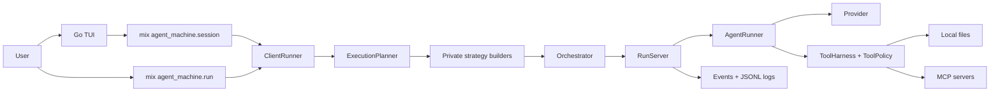

# AgentMachine

AgentMachine is a terminal-first agent runtime for local project work. It gives
models narrowly scoped capabilities, runs them through one adaptive agentic
runtime, and records enough structured evidence that you can audit what happened
afterward.

The project is intentionally small. The runtime lives in Elixir, the terminal UI
is a thin Go client, and every meaningful permission, budget, root path, model,
and provider value is explicit.

> Build agent runs that can read, edit, browse, run checks, and explain what
> happened without giving the model ambient authority.

## Contents

- [Why AgentMachine](#why-agentmachine)
- [What It Can Do](#what-it-can-do)
- [Core Concepts](#core-concepts)
- [Requirements](#requirements)
- [Quick Start](#quick-start)
- [Terminal UI](#terminal-ui)
- [CLI Usage](#cli-usage)
- [Required Values](#required-values)
- [Execution Strategy](#execution-strategy)
- [Tools](#tools)
- [MCP And Browser Work](#mcp-and-browser-work)
- [Skills](#skills)
- [Providers](#providers)
- [Context And Long Runs](#context-and-long-runs)
- [Observability](#observability)
- [Architecture](#architecture)
- [Safety Model](#safety-model)
- [Common Commands](#common-commands)
- [Development](#development)
- [Further Reading](#further-reading)
- [Project Status](#project-status)

## Why AgentMachine

Most AI coding tools make the easy path powerful by default. AgentMachine takes
the opposite stance: the useful path should still be explicit.

- **No hidden authority.** Tools are denied until a run is configured with a
  harness, root, timeout, round limit, and approval mode.
- **Visible execution strategy.** The agentic runtime can choose direct,
  read-only tool, planned, or swarm execution, and the selected strategy is
  emitted as a runtime event.
- **Provider boundaries stay clean.** Remote providers flow through ReqLLM.
  They do not own orchestration, tools, retries, or UI behavior.
- **Local project work is scoped.** File and code tools operate under an
  explicit root. Root escapes fail instead of being rewritten into relative
  paths.
- **Logs are first-class.** CLI and TUI runs can emit JSONL events, summaries,
  per-run logs, session logs, and redacted tool evidence.
- **The TUI is a client, not a second runtime.** The Go app persists local
  setup, displays progress, and talks to the Elixir CLI/session boundary.

## What It Can Do

| Area | Capabilities |
| --- | --- |
| Chat | Answer normal questions without exposing tools. |
| Local files | List, inspect, read, search, create, write, append, and replace files under an explicit root. |
| Code editing | Apply structured edits and unified patches, create checkpoints, roll back changes, and run allowlisted checks. |
| Agentic work | Route larger tasks through planner, worker, evaluator, and finalizer agents. |
| Swarms | Run explicit multi-variant agentic work in isolated variant workspaces, then evaluate the results. |
| Browser work | Use explicitly configured MCP tools such as Playwright for browser navigation and snapshots. |
| Skills | Load reusable instruction bundles, references, assets, and optional scripts. |
| Context | Track context budgets, compact conversations manually, and compact run context when configured. |
| Observability | Emit redacted JSON/JSONL output, telemetry events, run logs, session logs, and progress commentary. |

## Core Concepts

AgentMachine has a few rules that shape the whole project:

- **Runs are explicit specs.** A run is not started until the task,
  provider, timeout, step limit, attempt limit, and provider-specific values
  validate.
- **Routing is advice plus enforcement.** Classifiers can identify intent and
  suggest a route, but Elixir still checks harnesses, roots, approvals, MCP
  config, and exact test-command allowlists.
- **Tools are per-run capabilities.** A saved TUI setup does not give the model
  blanket access. Each run exposes only the tools selected by the route and
  runtime policy.
- **Agentic work is structured.** Planners return strict JSON, workers do the
  delegated work, evaluators compare swarm variants, and finalizers synthesize
  the user-facing result from recorded evidence.
- **Logs are part of the product.** Events, summaries, tool results, progress
  commentary, and session transcripts are designed to explain the run after it
  finishes.

## Requirements

- Elixir `1.15+` as declared by `mix.exs`
- Erlang/OTP compatible with the installed Elixir version
- Go `1.24.2` for the Bubble Tea terminal UI
- `rg` (`ripgrep`) for local file search tools
- Node.js `20+` only when using Playwright MCP through `npx`

On macOS with Homebrew:

```sh
brew install elixir ripgrep
```

Check the local toolchain:

```sh
elixir --version
mix --version
go version
rg --version
```

## Quick Start

Install dependencies:

```sh
make deps
```

Run a local smoke test with the built-in Echo provider:

```sh
make run-echo TASK="Summarize what AgentMachine can do"
```

Start the terminal UI:

```sh
make run
```

Install launchers into `~/.local/bin`:

```sh
make install
agent-machine
```

Override the install destination with an absolute path:

```sh
make install INSTALL_BIN_DIR=/absolute/bin/path
```

Run the full local quality gate:

```sh
make quality
```

## Terminal UI

The TUI is the primary interactive experience. It keeps provider setup, model
selection, tool configuration, MCP setup, skills, logs, context budgets, and
agent detail views in one terminal session.

Start it from the repository root:

```sh
make tui
```

or from the Go package:

```sh
cd tui
go run .
```

Useful first commands:

```text
/setup
/provider
/provider <provider-id>
/key <api-key>
/provider-secret <field> <value>
/provider-option <field> <value>
/models reload
/model
/router llm
/tools local-files . 120000 16 ask-before-write
/tools code-edit . 120000 16 ask-before-write
/mcp add playwright npx @playwright/mcp@latest
/skills list
/agents
/scroll up
```

The TUI supports:

- provider-specific model selection loaded through the Elixir provider catalog;
- saved provider secrets and non-secret setup fields in the local user config;
- automatic strategy display for direct, tool, planned, and swarm runs;
- interactive permission prompts for write, command, delete, and network risk;
- planner review with approve, decline, and revise decisions, forcing agentic
  runtime runs when enabled;
- sidechain session agents with `/agents`, `/agent <id>`,
  `/send-agent <id> <message>`, and `/read-agent <id>`;
- classic and Matrix-inspired themes with `/theme classic|matrix`;
- conversation compaction through `/compact`;
- chat transcript scrolling through `Ctrl+B`/`Ctrl+F`, `Ctrl+P`/`Ctrl+N`, or
  `/scroll up|down|top|bottom`;
- context controls through `/context ...`;
- progress commentary through `/progress observer on|off`.

User config is stored at:

```text
~/.agent-machine/tui-config.json
```

Set `AGENT_MACHINE_TUI_CONFIG` to use a specific config file. Project config is
read from the nearest `.agent-machine/tui-config.json`, but project config may
only override non-secret settings and path settings must stay inside the project
root.

Naming convention:

- Use `agent-machine` for launchers, user config directories, logs, and hidden
  runtime folders.
- Use `agent_machine` for Mix tasks, Elixir modules, file paths, and internal
  metadata keys where underscore naming is the actual API.

## CLI Usage

Use `mix agent_machine.run` for scriptable runs and exact flag control.

Basic local run:

```sh
mix agent_machine.run \
  --provider echo \
  --timeout-ms 30000 \
  --max-steps 2 \
  --max-attempts 1 \
  "Summarize this project"
```

Auto-routed JSONL run with deterministic routing:

```sh
mix agent_machine.run \
  --provider echo \
  --router-mode deterministic \
  --timeout-ms 30000 \
  --max-steps 6 \
  --max-attempts 1 \
  --jsonl \
  "Explain README.md"
```

Remote provider run:

```sh
mix agent_machine.run \
  --provider openrouter \
  --model <model-id> \
  --http-timeout-ms 30000 \
  --input-price-per-million <input-price> \
  --output-price-per-million <output-price> \
  --timeout-ms 120000 \
  --max-steps 6 \
  --max-attempts 1 \
  --jsonl \
  --stream-response \
  "Review this project and suggest the next small change"
```

Write an explicit JSONL run log:

```sh
mix agent_machine.run \
  --provider echo \
  --router-mode deterministic \
  --timeout-ms 30000 \
  --max-steps 6 \
  --max-attempts 1 \
  --log-file ./agent-machine-run.jsonl \
  "Review this project"
```

Compact a conversation:

```sh
mix agent_machine.compact \
  --provider openrouter \
  --model <model-id> \
  --http-timeout-ms 30000 \
  --input-price-per-million <input-price> \
  --output-price-per-million <output-price> \
  --input-file ./conversation.json \
  --json
```

The compact input must be:

```json
{"type":"conversation","messages":[{"role":"user","text":"..."}]}
```

## Required Values

AgentMachine fails fast when required runtime input is missing.

Every run requires:

- exactly one non-empty task;
- optional `--workflow agentic` for legacy callers; omit it for normal use;
- `--provider echo` or a supported ReqLLM provider ID such as `openai`,
  `anthropic`, `google_vertex`, `openrouter`, or `vllm`;
- `--timeout-ms <positive-int>`;
- `--max-steps <positive-int>`;
- `--max-attempts <positive-int>`.

Clients may pass structured conversation context without changing the current
task:

- `--recent-context <text>` for reference-only prior context;
- `--pending-action <text>` for affirmative follow-ups such as “yes, do it”.

Remote providers also require:

- `--model <id>`;
- `--http-timeout-ms <positive-int>`;
- repeated `--provider-option key=value` for providers such as Azure OpenAI,
  Google Vertex AI, Amazon Bedrock, and vLLM;
- `--input-price-per-million <number>`;
- `--output-price-per-million <number>`;
- required provider secrets in environment variables named by
  `mix agent_machine.providers --json` or saved TUI config.

Tool-enabled runs require the full tool budget:

- one or more `--tool-harness ...` values;
- `--tool-timeout-ms <positive-int>`;
- `--tool-max-rounds <positive-int>`;
- `--tool-approval-mode read-only|ask-before-write|auto-approved-safe|full-access`;
- `--tool-root <path>` when using `local-files` or `code-edit`;
- `--mcp-config <path>` when using `mcp`.

## Execution Strategy

There is one public runtime: `agentic`. The CLI accepts no workflow flag or
`--workflow agentic`; `chat`, `basic`, and `auto` fail fast at the public
boundary.

| Strategy | Purpose |
| --- | --- |
| `direct` | One no-tool assistant for plain conversation. |
| `tool` | One assistant with a narrow read-only tool set. |
| `planned` | Planner, delegated workers, optional evaluator/reviewer work, then finalizer. |
| `swarm` | Multiple explicit variants in isolated workspaces plus an evaluator. |

Auto routing supports three router modes:

```sh
--router-mode llm
--router-mode deterministic
--router-mode local --router-model-dir <dir> --router-timeout-ms <ms> --router-confidence-threshold <float>
```

LLM routing asks the selected provider/model through ReqLLM for JSON
classification, then Elixir strictly parses the response and validates
capabilities before any strategy starts. Deterministic guards still protect
obvious tool, file, test, browser, and mutation intents.

Agentic extras are opt-in:

```sh
--planner-review prompt --planner-review-max-revisions 2
--agentic-persistence-rounds 2
```

Planner review pauses worker scheduling until a plan is approved, declined, or
sent back for revision. Agentic persistence adds bounded reviewer rounds that
must either prove completion with structured evidence or delegate concrete
follow-up work.

Swarm strategy is selected when the task explicitly asks for variants,
competing solutions, a swarm, or several approaches. Variant workers run in
isolated workspaces under `.agent-machine/swarm/<run-id>/<variant-id>` and are
not merged back automatically.

## Tools

Tools are capabilities, not defaults. A model only sees the tools exposed for
the current route, harness, and approval mode.

| Harness | What it exposes |
| --- | --- |
| `demo` | The same safe current-time demo tool used by early smoke tests. |
| `time` | Current time/date lookup. |
| `local-files` | Directory creation, metadata, listing, reading, search, write, append, and exact replacement under `--tool-root`. |
| `code-edit` | File inspection, search, structured edits, patch application, checkpoints, rollback, optional test commands, and optional shell commands. |
| `mcp` | Namespaced tools from an explicitly validated MCP config. |
| `skills` | Selected skill resources and optional skill scripts. |

Approval modes:

| Mode | Meaning |
| --- | --- |
| `read-only` | Exposes read-risk tools only. |
| `ask-before-write` | Requires an approval callback for write, delete, command, or network risk. |
| `auto-approved-safe` | Allows safe configured actions without interactive approval. |
| `full-access` | Skips approval prompts for already allowed risk classes, but still obeys allowlists, roots, MCP config, and path guards. |

Read files under the current project root:

```sh
mix agent_machine.run \
  --provider openrouter \
  --model <model-id> \
  --http-timeout-ms 30000 \
  --input-price-per-million <input-price> \
  --output-price-per-million <output-price> \
  --timeout-ms 120000 \
  --max-steps 6 \
  --max-attempts 1 \
  --tool-harness local-files \
  --tool-root "$PWD" \
  --tool-timeout-ms 30000 \
  --tool-max-rounds 6 \
  --tool-approval-mode read-only \
  --jsonl \
  "Read README.md and summarize the public API"
```

Run an interactive code-edit session with JSONL permission control:

```sh
mix agent_machine.run \
  --provider openrouter \
  --model <model-id> \
  --http-timeout-ms 30000 \
  --input-price-per-million <input-price> \
  --output-price-per-million <output-price> \
  --timeout-ms 120000 \
  --max-steps 8 \
  --max-attempts 1 \
  --tool-harness code-edit \
  --tool-root "$PWD" \
  --tool-timeout-ms 120000 \
  --tool-max-rounds 16 \
  --tool-approval-mode ask-before-write \
  --permission-control jsonl-stdio \
  --jsonl \
  "Fix the failing tests"
```

Allow one exact test command:

```sh
mix agent_machine.run \
  --provider openrouter \
  --model <model-id> \
  --http-timeout-ms 30000 \
  --input-price-per-million <input-price> \
  --output-price-per-million <output-price> \
  --timeout-ms 120000 \
  --max-steps 8 \
  --max-attempts 1 \
  --tool-harness code-edit \
  --tool-root "$PWD" \
  --tool-timeout-ms 120000 \
  --tool-max-rounds 16 \
  --tool-approval-mode ask-before-write \
  --test-command "mix test" \
  --permission-control jsonl-stdio \
  --jsonl \
  "Run the allowlisted tests and fix failures"
```

Restore a code-edit checkpoint:

```sh
mix agent_machine.rollback \
  --tool-root /path/to/project \
  --checkpoint-id <checkpoint-id>
```

## MCP And Browser Work

MCP support is explicit and allowlist-based. A config must name each server,
transport, tool, permission, risk, and `inputSchema`.

Use the TUI Playwright preset:

```text
/mcp add playwright npx @playwright/mcp@latest
```

Use a standalone MCP config:

```text
/mcp-config /path/to/mcp.json 120000 50 ask-before-write
```

Or pass MCP to the CLI:

```sh
mix agent_machine.run \
  --provider openrouter \
  --model <model-id> \
  --http-timeout-ms 30000 \
  --input-price-per-million <input-price> \
  --output-price-per-million <output-price> \
  --timeout-ms 120000 \
  --max-steps 8 \
  --max-attempts 1 \
  --tool-harness mcp \
  --mcp-config examples/playwright.mcp.json \
  --tool-timeout-ms 120000 \
  --tool-max-rounds 50 \
  --tool-approval-mode ask-before-write \
  --permission-control jsonl-stdio \
  --jsonl \
  "Use Playwright MCP to open https://example.com and report the page title"
```

MCP security rules:

- stdio commands must be executable names or paths, not shell snippets;
- environment values must use `env:NAME` references;
- Streamable HTTP must use HTTPS unless the host is loopback;
- environment-sourced HTTP headers are rejected over plain HTTP;
- provider-visible tool names are namespaced as `mcp_<server>_<tool>`.

See [examples/playwright.mcp.json](examples/playwright.mcp.json).

## Skills

Skills are reusable instruction bundles installed under an explicit skills
directory. A skill is a folder with a required `SKILL.md` file and optional
`references/`, `assets/`, `scripts/`, and agent hint files.

Create a local skill:

```sh
mix agent_machine.skills create docs-helper \
  --skills-dir ~/.agent-machine/skills \
  --description "Helps write concise project documentation"
```

Generate a skill through a provider:

```sh
mix agent_machine.skills generate docs-helper \
  --skills-dir ~/.agent-machine/skills \
  --description "Helps write concise project documentation" \
  --provider openrouter \
  --model <model-id> \
  --http-timeout-ms 120000 \
  --input-price-per-million <input-price> \
  --output-price-per-million <output-price>
```

Manage installed skills:

```sh
mix agent_machine.skills list --skills-dir ~/.agent-machine/skills
mix agent_machine.skills search docs --skills-dir ~/.agent-machine/skills
mix agent_machine.skills show docs-helper --skills-dir ~/.agent-machine/skills
mix agent_machine.skills install docs-helper --skills-dir ~/.agent-machine/skills
mix agent_machine.skills remove docs-helper --skills-dir ~/.agent-machine/skills
```

Use skills in a run:

```sh
mix agent_machine.run \
  --provider openrouter \
  --model <model-id> \
  --http-timeout-ms 30000 \
  --input-price-per-million <input-price> \
  --output-price-per-million <output-price> \
  --timeout-ms 120000 \
  --max-steps 8 \
  --max-attempts 1 \
  --skills auto \
  --skills-dir ~/.agent-machine/skills \
  "Update the README"
```

More detail is in [docs/skills.md](docs/skills.md).

## Providers

AgentMachine keeps `echo` as the local offline provider. Every remote provider
uses the shared `AgentMachine.Providers.ReqLLM` runtime boundary.

List supported providers and required setup fields:

```sh
mix agent_machine.providers --json --include-unsupported
```

List priced models for one configured provider:

```sh
mix agent_machine.providers models --provider openrouter --json
```

Supported ReqLLM provider IDs are:

| Provider ID | Label |
| --- | --- |
| `alibaba` | Alibaba Cloud Bailian |
| `alibaba_cn` | Alibaba Cloud Bailian China |
| `anthropic` | Anthropic |
| `openai` | OpenAI |
| `google` | Google Gemini |
| `google_vertex` | Google Vertex AI |
| `amazon_bedrock` | Amazon Bedrock |
| `azure` | Azure OpenAI |
| `groq` | Groq |
| `xai` | xAI |
| `openrouter` | OpenRouter |
| `cerebras` | Cerebras |
| `meta` | Meta Llama |
| `zai` | Z.AI |
| `zai_coder` | Z.AI Coder |
| `zenmux` | Zenmux |
| `venice` | Venice |
| `vllm` | vLLM |

`minimax` is intentionally not exposed because ReqLLM 1.11 does not document a
MiniMax provider ID.

Remote runs require explicit model, HTTP timeout, pricing, provider setup, and
required secrets. Secrets are read from environment variables or injected by the
TUI; they are not passed as CLI arguments or session payload fields.

AgentMachine configures ReqLLM's shared Finch stream pool explicitly with 32
HTTP/1 connections. Planned agentic runs may have a planner, workers, progress
observer, and provider tool continuations streaming at the same time, so the app
does not rely on ReqLLM's smaller library default pool.

Examples:

```sh
export OPENROUTER_API_KEY="..."
mix agent_machine.run \
  --provider openrouter \
  --model openai/gpt-4o-mini \
  --http-timeout-ms 120000 \
  --input-price-per-million 0.15 \
  --output-price-per-million 0.60 \
  --timeout-ms 120000 \
  --max-steps 2 \
  --max-attempts 1 \
  "Reply with one concise sentence."
```

```sh
export AGENT_MACHINE_GOOGLE_VERTEX_ACCESS_TOKEN="..."
mix agent_machine.run \
  --provider google_vertex \
  --provider-option project_id=my-project \
  --provider-option region=us-central1 \
  --model gemini-2.5-flash \
  --http-timeout-ms 120000 \
  --input-price-per-million <input-price> \
  --output-price-per-million <output-price> \
  --timeout-ms 120000 \
  --max-steps 2 \
  --max-attempts 1 \
  "Reply with one concise sentence."
```

The TUI provider picker renders the catalog fields provider-by-provider, saves
selected models in a provider-keyed map, and injects configured secrets into the
Mix child process environment.

## Context And Long Runs

Context budget monitoring is opt-in and measured against the actual provider
request body when a tokenizer path is configured.

```sh
mix agent_machine.run \
  --provider openrouter \
  --model <model-id> \
  --http-timeout-ms 30000 \
  --input-price-per-million <input-price> \
  --output-price-per-million <output-price> \
  --timeout-ms 120000 \
  --max-steps 8 \
  --max-attempts 1 \
  --context-window-tokens 128000 \
  --context-warning-percent 80 \
  --context-tokenizer-path ./tokenizer.json \
  --reserved-output-tokens 4096 \
  --run-context-compaction on \
  --run-context-compact-percent 90 \
  --max-context-compactions 2 \
  --jsonl \
  "Plan and execute the task"
```

If the tokenizer or context window is missing, AgentMachine reports the budget
as unknown instead of guessing. Automatic run-context compaction only runs when
all required values are present.

High-level timeouts use an idle lease derived from `--timeout-ms` and a hard cap
of three times that lease. Runtime activity can keep a run alive until the hard
cap, and timeout events are logged.

## Observability

AgentMachine exposes several levels of runtime evidence:

- text summaries for humans;
- JSON summaries for scripts;
- JSONL events for live progress;
- explicit `--log-file` and `--event-log-file` outputs;
- TUI session logs under the user config directory;
- telemetry events for run, agent, tool, MCP call, and routing activity;
- redacted summaries, logs, and read-style tool results.

The optional progress observer is a background sidecar. It receives bounded,
redacted runtime evidence, has no tool access, cannot change run state, and
emits `progress_commentary` events only for UI/log display.

## Architecture



Ownership boundaries:

- `AgentMachine.Orchestrator` and `AgentMachine.RunServer` own run state,
  scheduling, retries, delegation, finalizers, artifacts, and usage totals.
- `AgentMachine.AgentRunner` executes one validated agent through one provider
  and handles provider-native tool continuation.
- `AgentMachine.ToolHarness` and `AgentMachine.ToolPolicy` expose tools and
  enforce permission metadata.
- `AgentMachine.MCP.*` owns MCP config parsing, protocol transport, namespacing,
  permissions, and result normalization.
- `AgentMachine.ExecutionPlanner` selects `direct`, `tool`, `planned`, or
  `swarm`; `AgentMachine.Workflows.*` remains a private strategy builder layer.
- `tui/` is a Bubble Tea client over the CLI/session boundary.

For a deeper sequence view, read [docs/runtime-flow.md](docs/runtime-flow.md)
or open [docs/agent-runtime-flow.puml](docs/agent-runtime-flow.puml).

## Safety Model

AgentMachine is built around explicit failure instead of fallback behavior.

- Missing required input fails before model execution.
- Missing provider keys fail through environment lookup.
- Missing pricing is an error for remote provider runs.
- Missing tool budgets fail instead of using guessed limits.
- Tools are denied by default.
- File and code tools require an explicit root.
- Paths outside the root fail.
- Test commands must match an exact allowlist entry.
- MCP configs must be explicit and schema-bearing.
- `ask-before-write` requires a runtime approval callback for risky tools.
- Logs and summaries pass through `AgentMachine.Secrets.Redactor`.

The model can request a tool call. The runtime decides whether the call exists,
whether it is allowed, whether it needs approval, how long it may run, and how
the result is bounded and redacted.

## Common Commands

```sh
make help
make deps
make test
make quality
make run
make tui
make tui-test
make tui-build
make install
make run-echo TASK="Summarize this project"
make run-echo-json TASK="Summarize this project"
make run-echo-jsonl TASK="Summarize this project"
```

Paid OpenRouter checks are excluded from the normal quality gate:

```sh
OPENROUTER_API_KEY="..." make test-openrouter-paid
OPENROUTER_API_KEY="..." make test-openrouter-playwright-mcp
OPENROUTER_API_KEY="..." make test-openrouter-swarm-e2e
```

## Development

Run focused Elixir tests:

```sh
mix test
```

Run Go TUI tests:

```sh
make tui-test
```

Run the full local quality gate:

```sh
mix quality
```

`mix quality` checks formatting, compiles with warnings as errors, runs Credo in
strict mode, and runs the Elixir test suite.

Format code:

```sh
make format
```

## Further Reading

- [FEATURES.md](FEATURES.md) maps implemented features to docs and modules.
- [docs/runtime-flow.md](docs/runtime-flow.md) explains routing, session agents,
  planner delegation, observers, and tool permission flow.
- [docs/skills.md](docs/skills.md) documents skill creation, installation,
  validation, runtime use, and registry format.
- [plan.md](plan.md) tracks deferred work.
- [CHANGELOG.md](CHANGELOG.md) records completed changes.

## Project Status

AgentMachine is version `0.1.0` and evolving quickly. Public behavior is kept
explicit and tested, but the project is still moving one small runtime iteration
at a time.
