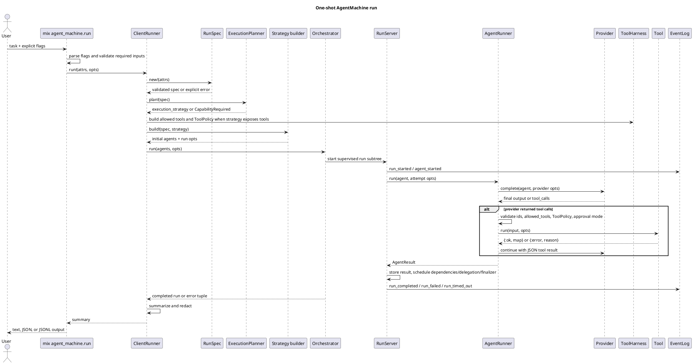
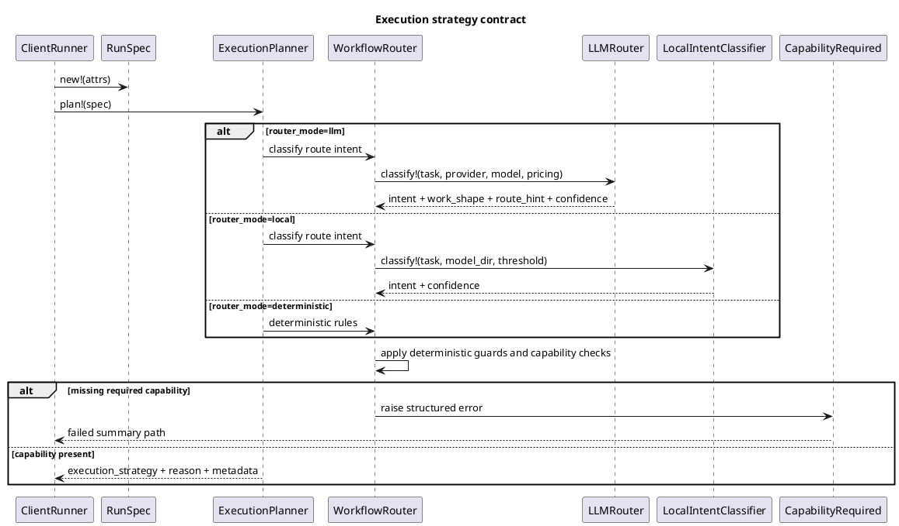
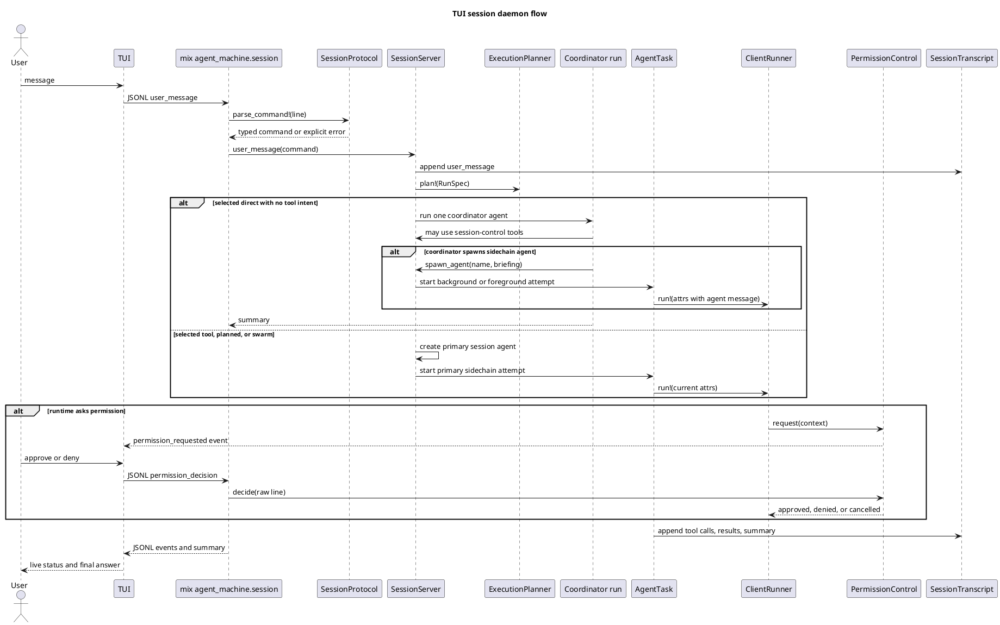
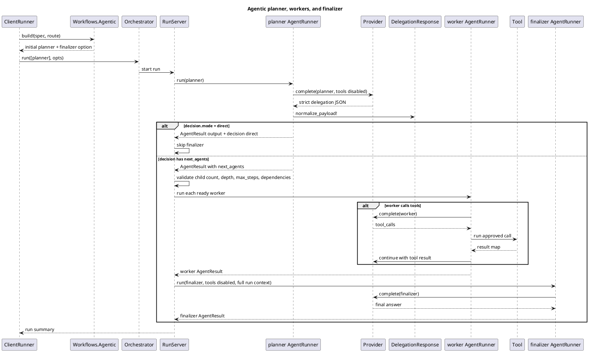
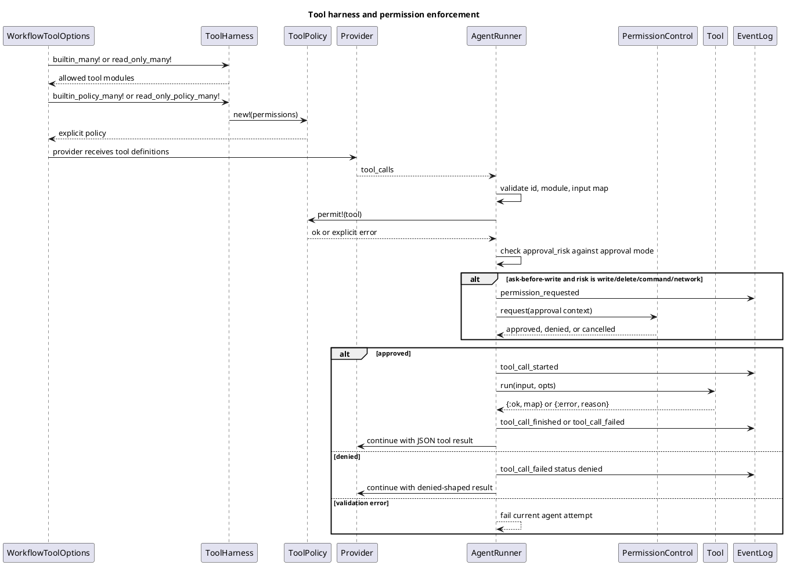
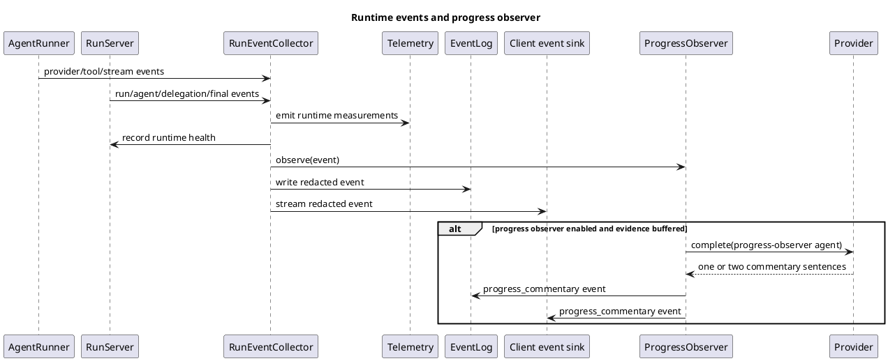

# AgentMachine Runtime Flow

This document explains the runtime path from a user request to a final answer,
with the responsibilities and contracts of the router, session daemon, session
agents, planner, observer, and tool harness permission model.

The main rule to keep in mind is that the model does not own runtime authority.
Models can produce text, structured delegation JSON, or provider-native tool
calls. Elixir validates the contract, checks capabilities, enforces tool policy,
executes tools, records events, and decides when the run is complete.

## Main Roles

| Role | Runtime module(s) | Responsibility | Must not do |
| --- | --- | --- | --- |
| CLI boundary | `Mix.Tasks.AgentMachine.Run` | Parse flags, fail fast on invalid options, configure event logs and permission control, call `ClientRunner`. | Hide missing required configuration behind defaults. |
| Session daemon | `Mix.Tasks.AgentMachine.Session`, `SessionServer` | Keep one long-lived JSONL stdio session for the TUI, persist session context, route user messages, own sidechain session agents, pass permission decisions to the active runtime. | Reimplement orchestration, dependency scheduling, or tool execution. |
| Execution planner | `ExecutionPlanner`, `WorkflowRouter`, `LLMRouter`, `LocalIntentClassifier` | Convert a `RunSpec` into `direct`, `tool`, `planned`, or `swarm`. Validate required capabilities before a strategy starts. | Execute tools, grant permissions, or treat classifier hints as authority. |
| Client runner | `ClientRunner` | Build `RunSpec`, select execution strategy and skills, build private strategy agents/options, install event sinks, summarize and redact results. | Run agents directly or bypass the orchestrator. |
| Strategy builder | `Workflows.Chat`, `Tool`, `Agentic` | Build initial agent specs and run options for the selected strategy. | Decide permissions outside `RunSpec` and `ToolHarness`. |
| Orchestrator facade | `Orchestrator` | Validate agent graph and run limits, start one supervised run subtree, await completion or timeout. | Interpret model output itself. |
| Run owner | `RunServer` | Own one run state: ready/pending tasks, dependencies, retries, delegation, finalizer, artifacts, usage, events, timeouts. | Call providers directly. |
| Agent execution | `AgentRunner` | Execute one agent attempt through exactly one provider, normalize output, run allowed tools, continue provider tool loops. | Spawn workers or decide execution strategy. |
| Planner | Agent id `planner` in `Workflows.Agentic` | Return strict JSON describing direct answer, delegated workers, or swarm workers. Tools are disabled for this agent. | Edit files, browse, run commands, or claim worker results before workers run. |
| Worker | Delegated agent returned in `next_agents` | Perform delegated work. If tools are exposed, workers may call them subject to policy and approval. | Assume permission not granted by the runtime. |
| Finalizer | Agent id `finalizer` | Produce the final user-facing answer from prior results, artifacts, and tool results. Tools are disabled. | Delegate follow-up agents or claim side effects without evidence. |
| Observer | `RunEventCollector`, optional `ProgressObserver` | Forward events to telemetry/log/client sinks. Optional observer creates short progress commentary from bounded evidence. | Affect routing, permissions, tool execution, summaries, or conversation truth. |
| Tool harness | `ToolHarness`, `ToolPolicy`, `Tool` modules | Convert explicit harness choices into provider-visible tool definitions plus runtime permission policy. | Expose tools silently or skip approval-risk checks. |

## One-Shot Run

This is the normal CLI path and also the path used by session sidechain agents.



Key contracts:

- `RunSpec.new!/1` is the first runtime contract. Required fields include
  `task`, `provider`, `timeout_ms`, `max_steps`, and `max_attempts`. Public
  `workflow` is optional and may only be `agentic`. Remote providers also
  require explicit model, HTTP timeout, and pricing.
- Tool options are all-or-nothing. A run with tool options must specify a
  harness or harness list, timeout, max rounds, approval mode, and any required
  root or MCP config.
- `ClientRunner` catches `CapabilityRequired` from the router and returns a
  structured failed summary instead of starting a model call.
- `Orchestrator` only starts a run after the agent ids, dependency graph,
  finalizer id, run id, limits, and event sink are valid.
- `AgentRunner` treats provider and tool contracts strictly. Invalid provider
  payloads, missing tool state for tool calls, repeated tool call ids, unknown
  tools, or missing runtime options fail the agent attempt.

## Execution Planner

The execution planner answers one question: which internal strategy should
handle this request?
It does not execute the request.



Strategy meanings:

- `direct`: one no-tool assistant. Used for normal conversation.
- `tool`: one assistant with narrow read-only tools.
- `planned`: planner first, optional workers, then finalizer. Used for broad
  analysis, explicit delegation, mutation, code-edit, test, and web browse when
  required capabilities are present.
- `swarm`: planner-created variants plus evaluator and finalizer.
- `session`: internal daemon coordinator route for conversational TUI session
  turns. It is not a public strategy value.

The LLM router contract is strict JSON:

```json
{
  "intent": "file_read",
  "work_shape": "broad_project_analysis",
  "route_hint": "agentic",
  "confidence": 0.91,
  "reason": "short reason"
}
```

`route_hint` is advisory only. Elixir still checks required harnesses,
approval modes, MCP browser configuration, test command allowlists, and write
capability before any strategy starts.

## Session Daemon And Session Agents

The TUI uses `mix agent_machine.session --jsonl-stdio` as a long-lived daemon.
The daemon keeps a session context ledger and sidechain agent transcripts. It
accepts JSONL commands such as `user_message`, `permission_decision`,
`send_agent_message`, `read_agent_output`, `cancel_agent`, and `shutdown`.



Important distinction:

- A **runtime agent** is an `AgentMachine.Agent` inside one orchestrated run
  (`assistant`, `planner`, worker ids, `finalizer`, `coordinator`).
- A **session agent** is a long-lived TUI sidechain record owned by
  `SessionServer` (`agent-1`, `agent-2`, and names chosen by the coordinator).
  Each session-agent attempt calls `ClientRunner.run!/2`, so it uses the same
  execution planner, private strategy builders, orchestrator, tools, and permission checks as a
  one-shot run.
- The **coordinator** is daemon-only. It can answer conversational session
  turns and can use session-control tools to spawn/read/message/list session
  agents. Those tools do not grant filesystem, MCP, command, or network access.

Session protocol fail-fast rules:

- Unknown command types fail.
- `user_message` requires a typed `run` object.
- `send_agent_message`, `read_agent_output`, and `cancel_agent` require an
  `agent_id` or `name`.
- Session tool timeout and max-round values are required for coordinator
  session-control tools.
- Invalid permission control input cancels pending permission requests.

## Planned Strategy Flow

The planned strategy is the planner-to-worker path. The planner is a model agent,
but it has no runtime authority. It returns JSON. The runtime decides whether
that JSON is valid, starts workers, enforces graph limits, and starts the
finalizer when the run is idle.



Planner contract:

- The planner has `metadata.agent_machine_response = "delegation"`.
- The planner has `metadata.agent_machine_disable_tools = true`.
- Direct mode JSON shape:

```json
{
  "decision": {"mode": "direct", "reason": "non-empty reason"},
  "output": "final answer",
  "next_agents": []
}
```

- Delegation mode JSON shape:

```json
{
  "decision": {"mode": "delegate", "reason": "non-empty reason"},
  "output": "short planning note",
  "next_agents": [
    {
      "id": "worker-id",
      "input": "worker task",
      "instructions": "optional worker instructions"
    }
  ]
}
```

The planner may describe desired work, but the runtime owns execution. Workers
inherit runtime options from the selected strategy. If no tool harness is
exposed, a worker cannot perform filesystem, MCP, command, or network side
effects.

Finalizer contract:

- The finalizer has tools disabled.
- It receives prior results, artifacts, tool results, selected skills, compact
  runtime facts, and execution strategy context.
- It must summarize only evidenced work.
- If it returns `next_agents`, the run fails because finalizers must not
  delegate follow-up work.

## Tool Harness And Permissions

The "AI harness" is the provider-visible side of explicit runtime capability.
`ToolHarness` chooses which tool definitions the provider can see, while
`ToolPolicy` defines what the runtime will execute.



Every executable tool has this contract:

```elixir
@callback run(map(), keyword()) :: {:ok, map()} | {:error, term()}
@callback permission() :: atom()
@callback approval_risk() :: :read | :write | :delete | :command | :network
@callback definition() :: %{
  name: binary(),
  description: binary(),
  input_schema: map()
}
```

`definition/0` is required when the tool is exposed to provider-native tool
calling. `permission/0` and `approval_risk/0` are required for execution.

Approval modes:

| Mode | Automatically allowed risks | Prompted risks | Rejected risks |
| --- | --- | --- | --- |
| `read_only` | `read` | none | `write`, `delete`, `command`, `network` |
| `ask_before_write` | `read` | `write`, `delete`, `command`, `network` | none, if an approval callback exists |
| `auto_approved_safe` | `read`, `write` | none | `delete`, `command`, `network` |
| `full_access` | `read`, `write`, `delete`, `command`, `network` | none | none |

Harness meanings:

- `time` and `demo`: expose the safe `now` tool.
- `local-files`: list, read, search, inspect, create directory, write, append,
  and exact replacement under `tool_root`.
- `code-edit`: file info, list, read, search, structured edits, unified patch,
  and rollback checkpoint under `tool_root`.
- `mcp`: expose only MCP tools from explicit MCP config, with namespaced
  provider-visible names and configured input schemas.
- `skills`: expose skill resource list/read tools, plus `run_skill_script`
  only when skill scripts are explicitly allowed.

Additional permission rules:

- Local filesystem tools require an explicit existing `tool_root`.
- Paths are constrained under `tool_root`. Absolute tool paths outside the root
  fail the current agent attempt.
- `run_test_command` appears only for `code-edit` when exact allowlisted test
  commands are configured and approval mode is `full_access` or
  `ask_before_write`.
- Shell tools appear only for `code-edit` under `full_access` or
  `ask_before_write`.
- Duplicate provider-visible tool names fail before provider use.
- MCP tool input is validated against the configured schema before transport.

Current-attempt capability grants:

When permission control is active and tools are already exposed, the runtime
adds the safe `request_capability` tool. A model may ask for one of:

- `local_files` with a root.
- `code_edit` with a root.
- `mcp_tool` with a configured provider-visible MCP tool name.
- `test_command` with an exact configured test command.

The request must be the only tool call in that provider round. The runtime
emits a `permission_requested` event with `kind = capability_grant`, waits for
the human/TUI decision, validates the requested capability, and grants tools
only to the current agent attempt.

## Observer And Event Flow

The observer is for progress visibility. It is not a planner, not a worker,
and not a source of truth.



Observer contract:

- It requires an OpenAI or OpenRouter provider and model. The echo provider is
  rejected because observer commentary itself is model-generated.
- It receives bounded, redacted evidence from runtime events such as tool
  results, agent finish events, and delegation scheduling.
- Its provider options explicitly reject runtime and tool keys such as
  `allowed_tools`, `tool_policy`, `permission_control`, `mcp_config`, and
  `event_sink`.
- It emits `progress_commentary` events with `source = observer`.
- Private evidence is stripped before events are logged or summarized.
- Observer failures are swallowed for progress purposes and do not fail the run.

## Start-To-Finish Route Examples

### Normal Direct Answer

1. TUI or CLI sends a task to the agentic runtime.
2. Planner classifies `intent = none`.
3. Selected strategy is `direct`.
4. Strategy builder creates one no-tool `assistant`.
5. Provider returns output.
6. Summary final output is the assistant output.

### Narrow file read

1. Request asks to read, list, search, or inspect local files.
2. Planner requires a read-capable harness such as `local-files` or `code-edit`.
3. Selected strategy is `tool`.
4. Strategy builder exposes only read-risk tools.
5. Assistant calls read/list/search tools.
6. Tool results are returned to the provider until final output or
   `tool_max_rounds` is reached.

### Code edit

1. Request asks to create, edit, patch, or fix code.
2. Planner requires `code-edit`.
3. Selected strategy is `planned`.
4. Planner tools are disabled, so the planner delegates an exact worker task.
5. Worker uses code-edit tools under `tool_root`.
6. Approval mode controls whether writes run directly, prompt the user, or are
   rejected.
7. Finalizer reports only confirmed worker output and tool results.

### TUI conversational session with background agent

1. TUI sends `user_message` to the session daemon.
2. Planner selects daemon coordinator route for direct turns with no tool intent.
3. Coordinator may answer directly or call `spawn_agent`.
4. `SessionServer` creates a session agent transcript and starts `AgentTask`.
5. `AgentTask` runs the normal `ClientRunner` path for that agent attempt.
6. TUI can later call `read_agent_output` or `send_agent_message`.

## Practical Debugging Map

- Strategy selected unexpectedly: inspect `execution_strategy_selected` events
  and `execution_strategy` in the final summary.
- Missing harness or approval: inspect `capability_required` events or summary
  fields.
- Tool did not run: inspect `permission_requested`, `permission_decided`,
  `tool_call_started`, and `tool_call_failed` events.
- Planner did not create workers: inspect `results["planner"].decision` and
  `results["planner"].output`.
- Session sidechain confusion: inspect the session context ledger and
  per-agent transcript under the configured session directory.
- Observer text seems wrong: treat it as UI commentary only; verify against
  runtime events and final summary.

## Source Files

- `lib/agent_machine/client_runner.ex`
- `lib/agent_machine/workflow_router.ex`
- `lib/agent_machine/llm_router.ex`
- `lib/agent_machine/session_server.ex`
- `lib/agent_machine/agent_task.ex`
- `lib/agent_machine/workflows/*.ex`
- `lib/agent_machine/orchestrator.ex`
- `lib/agent_machine/run_server.ex`
- `lib/agent_machine/agent_runner.ex`
- `lib/agent_machine/tool_harness.ex`
- `lib/agent_machine/tool_policy.ex`
- `lib/agent_machine/permission_control.ex`
- `lib/agent_machine/progress_observer.ex`
- `lib/agent_machine/run_event_collector.ex`
